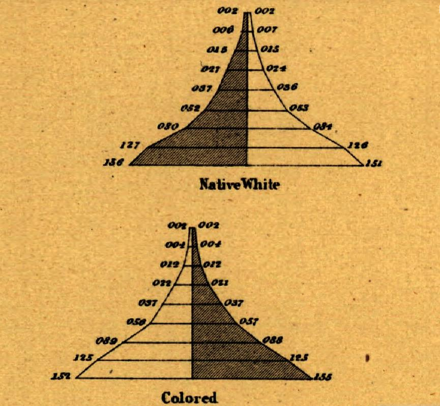

```{r message=FALSE, warning=FALSE}
knitr::opts_chunk$set(
	echo = TRUE,
	message = FALSE,
	warning = FALSE
)
library(tidyverse)
library(readxl) 
library(knitr)
library(cowplot)
library(ggimage)
library(ggiraph)
library(ggpubr)

source(file = "graphe brouillon.R")
library(fmsb)
library(missMDA)
```

Le but ce travail est de reproduire la pyramide des âges réalisé par Francis Walker qu'on présente dans la figure suivante

{#id .class width="50%" height="30%"}

On a relevé les différentes données sur le graphique directement.

```{r}
Native_white <- read_excel("Data/Histoire/HISTOIRE.xlsx", sheet = "Native white")
colored <- read_excel("Data/Histoire/HISTOIRE.xlsx", sheet = "Colored") %>% as_tibble()
Native_white = as_tibble(Native_white);(Native_white)
```

Cependant ne disposant d'assez d'information sur les tranches d'âge de chaque barre, on supposera que les classes représentées sont d'amplitude 10.

```{r}
Native_white <- Native_white %>%
  mutate(Age = factor(paste(seq(0, 80, 10), seq(10, 90, 10), sep = "-" ), ordered = T))
```

## Reproduction des deux pyramides

On combine les couches `geom_bar()` et `geom_area()` afin de reproduire ce graphique.

```{r fig.align="center", fig.width=8, fig.asp=1, fig.height=6}
NW <-  Native_white %>%
  ggplot(aes(x = 1:9)) +
  # Masculin
  geom_area(aes( y = -M), fill = "#503A22ff", colour = "black", size = 1) +
  geom_bar( aes(y = -M), stat = "identity", colour = "black", size = 1, width = 0 )+
  
  ## Féminin
  geom_area(aes( y = `F`), fill = "#E8B35Eff" , colour = "black", size = 1) +
  geom_bar( aes(y = `F`), stat = "identity",colour = "black", size = 1, width = 0 ) + 
  
  # Le thème 
  theme(
    plot.background = element_rect(fill = "#E8B35Eff"),
    panel.background = element_rect(fill = "#E8B35Eff"),
    panel.grid.major = element_blank(), 
    panel.grid.minor = element_blank(),
    axis.text.x = element_blank(),
    axis.text.y = element_blank(),
    axis.ticks = element_blank(),
    text = element_text(face = "bold", size = 15)) + 
  xlab("") + ylab("") +
  # Ajout des effectif
  ## Le ifelse pour afficher les 0 a gauche des nombre car 
  ## R les enlèves par défaut
  annotate(geom = "text", x = 1:9 + 0.1, y = -Native_white$M -10,
           label =ifelse(str_length(Native_white$M)==2, 
                         paste(0,Native_white$M,sep = ""),
                         ifelse(str_length(Native_white$M)==1, 
                                paste("00",Native_white$M,sep = ""),Native_white$M)),
           fontface = "bold.italic") +
  
  annotate(geom = "text", x = 1:9 + 0.1, y = (Native_white$`F` + c(12,12,12,12,10,8,8,8,8)),
           label = ifelse(str_length(Native_white$`F`)==2, 
                          paste(0,Native_white$`F`,sep = ""),
                          ifelse(str_length(Native_white$`F`)==1, 
                                 paste("00",Native_white$`F`,sep = ""),Native_white$`F`)),
           fontface = "bold.italic") + 
  ylab("Native White") +
  geom_segment(aes(x = 1, xend = 9, y = 0, yend = 0), lwd = 1) +
  coord_flip()


C <- colored %>%
  ggplot(aes(x = 1:9)) +
  
  geom_area(aes( y = -M), fill = "#E8B35Eff", colour = "black", size = 1) +
  geom_bar( aes(y = -M), stat = "identity", colour = "black", size = 1, width = 0 )+
  
  geom_area(aes( y = `F`), fill = "#503A22ff", colour = "black", size = 1) +
  geom_bar( aes(y = `F`), stat = "identity",colour = "black", size = 1, width = 0 ) + 
  
  theme(
    plot.background = element_rect(fill = "#E8B35Eff"),
    panel.background = element_rect(fill = "#E8B35Eff"),
    panel.grid.major = element_blank(), 
    panel.grid.minor = element_blank(),
    axis.text.x = element_blank(),
    axis.text.y = element_blank(),
    axis.ticks = element_blank(),
    text = element_text(face = "bold", size = 15)) + 
  xlab("") + ylab("") +
  
  annotate(geom = "text", x = 1:9 + 0.1, y = -colored$M -10, 
           label = ifelse(str_length(colored$M)==2, paste(0,colored$M,sep = ""),
                          ifelse(str_length(colored$M)==1, 
                                 paste("00",colored$M,sep = ""),colored$M)),
           fontface = "bold.italic") +
  ## on ajoute des valeur sur les coordonnées afin d'ajustées la position
  annotate(geom = "text", x = 1:9 + 0.1, y = (colored$`F` + c(12,12,12,12,10,8,8,8,8)), 
           label = ifelse(str_length(colored$`F`)==2, paste(0,colored$`F`,sep = ""),
                          ifelse(str_length(colored$`F`)==1, 
                                 paste("00",colored$`F`,sep = ""),colored$`F`)),
           fontface = ("bold.italic")) + 
  ylab("Colored") +
  
  geom_segment(aes(x = 1, xend = 9, y = 0, yend = 0), lwd = 1) +
  coord_flip()

plot_grid(NW, C, nrow = 2, ncol = 1 )
```

# Amélioration du graphique

Ce graphique proposé par Walker est loin d'être parfait dans la mesures où toutes les informations ne sont pas visibles (titre, classes d'age, etc...). On se propose de l'améliorer dans la suite.

```{r fig.width=7, fig.asp=0.8}
## Un dataframe qui contient les différentes position des etiquette
position = data.frame(M = -Native_white$M - 5, `F` = Native_white$`F` +5)

Native_white %>%
  ggplot(aes(x = c(1:9))) +
  
  geom_bar( aes(y = -M), stat = "identity", width = 0.95, size = 3, fill ="#4682B4") +
  geom_bar( aes(y = `F`), stat = "identity", width = 0.95, size = 3, fill = "#C6116B") + 
  
  theme_light() +
  xlab("") + ylab("") +
   # coord_flip() +
  
  theme(panel.grid.major = element_blank(),
        panel.grid.minor = element_blank(),
        axis.line = element_line(colour = 1, 
                      size = 0.65, linetype = "solid"),
        plot.title = element_text(face = "bold", hjust = 0.5, size = 13),
        plot.caption = element_text(face = "bold", hjust = 1, size = 12),
        plot.subtitle = element_text(face = "italic", hjust = 0, size = 13),
        panel.border = element_rect(colour = 1, 
                      size = 0.65, linetype = "solid")) +
  
  scale_x_continuous(n.breaks = 9, labels = c("","0-10", "10-20", "20-30", "30-40",
                                              "40-50", "50-60", "60-70","70-80",
                                              "80-90","")) +
  scale_y_continuous(n.breaks = 8, labels = c(rev(seq(0,150,50)), seq(50,150,50))) + 
  coord_flip() +
  labs(title = "Nebraska population structure", caption = "Made by OUOROU Rachidou") +#Made by Françis Walker (1874)
  geom_image(aes(x = 8, y = -100), image = "MALEE.png", size = 0.1) +
  geom_image(aes(x = 8, y = 100), image = "FEMALEE.png", size = 0.1) +
  geom_label(aes(y = position$M , label = M), fill = "#4682B4", col = "white", fontface = "bold") +
  geom_label(aes(y = position$`F`, label = `F`), fill = "#C6116B", col = "white", fontface = "bold")
```

Cette première version est déjà plus agréable à regarder que la première. On se propose également de l'améliorer en le rendant interactif. On utilise a cet effet le package `ggiraph`

# Interactivité du graphique

```{r fig.width=7, fig.asp=0.8}
age = c("0-10", "10-20", "20-30", "30-40",
        "40-50", "50-60", "60-70","70,80",
        "80-90")

## Un dataframe qui contient ce que doit afficher l'interactivité
tool = data.frame(
  label_M = paste("Masculin", "\n" ,"Age : ", age, "\n", "Effectif :", Native_white$M, sep = " "),
  label_F = paste("Féminin", "\n","Age : ", age, "\n", "Effectif :", Native_white$`F`, sep = " "))

a = Native_white %>%
  ggplot(aes(x = c(1:9))) +
  ## Les fonction qui permettent de crée des barres interactives
  ## L'argument tooltip prend l'affichage de la bulle lorsque le curseur survole la barre
  geom_bar_interactive( aes(y = -M, data_id = M, tooltip = tool$label_M), stat = "identity", width = 0.95, size = 3, fill ="#4682B4") +
  geom_bar_interactive( aes(y = `F`, data_id = `F`, tooltip = tool$label_F), stat = "identity", width = 0.95, size = 3, fill = "#C6116B") + 
  
  theme_light() +
  xlab("") + ylab("") +
  # coord_flip() +
  
  theme(
    panel.grid.major = element_blank(),
        panel.grid.minor = element_blank(),
        axis.line = element_line(colour = 1, 
                                 size = 0.65, linetype = "solid"),
        plot.title = element_text(face = "bold", hjust = 0.5, size = 13),
        plot.caption = element_text(face = "bold", hjust = 1, size = 12),
        panel.border = element_rect(colour = 1, 
                                    size = 0.65, linetype = "solid")) +
  
  scale_x_continuous(n.breaks = 9, labels = c("","0-10", "10-20", "20-30", "30-40",
                                              "40-50", "50-60", "60-70","70,80",
                                              "80-90","")) +
  scale_y_continuous(n.breaks = 8, labels = c(rev(seq(0,150,50)), seq(50,150,50))) + 
  coord_flip() +
  
  labs(title = "Nebraska population structure", caption = "Made by OUOROU Rachidou ") +
  
  geom_image(aes(x = 8, y = -100), image = "MALEE.png", size = 0.1) +
  geom_image(aes(x = 8, y = 100), image = "FEMALEE.png", size = 0.1)

ggiraph(code = print(a),hover_css = "cursor:pointer;fill:skyblue;stroke:skyblue;stroke-width:2pt;" ,
        tooltip_extra_css = "background-color:skyblue;color:white;font-style:italic;padding:10px;border-radius:10px 20px 10px 20px;",
        tooltip_opacity = 1 )


```

## Revisiter et actualiser le graphique

### Première méthode

L'une des finalités de la pyramide des âges est la comparaison de deux population. Soit deux populations différentes ou la même population à des dates différentes. Cependant affiché les deux pyramide séparément ne permet pas de visualiser directement la différence. On se propose donc de superposer deux pyramide des âges afin de mieux visualiser la différence entre les structures des deux populations. Cette fois on utilise les vraies données de la France en 1980 et en 2020. On fera les deux pyramide sur le même graphe afin d'étudier l'évolution de la population Française.

```{r fig.width=7, fig.asp=0.8}
## données de 1980

r = read.csv("Data/France/France-1980.csv", sep = ",")
r$Year <- rep(1980, length(r$M))
r$Age = factor(r$Age, levels = unique(r$Age), ordered = T)
r$M = -r$M

## Données de 2020
r1 = read.csv("Data/France/France-2020.csv", sep = ",")
r1$Year <- rep(2020, length(r1$M))
r1$Age = factor(r1$Age, levels = unique(r1$Age), ordered = T)
r1$M = -r1$M

## Aggrégation des deux données
r4 = rbind(r, r1)
r4 <- pivot_longer(r4, c(M, `F`), names_to = "Sexe", values_to = "Eff")
r4

## Préparation de l'affichage interactif
Male = c(paste("1980 : Male", r1$Age, "\n", abs(r4$Eff[r4$Year == 1980 & r4$Sexe == "M"]), sep = 
        " ") ,
        paste("2020 : Male",r1$Age,"\n",  abs(r4$Eff[r4$Year == 2020 & r4$Sexe == "M"]), sep = 
        " "))

Female = c(paste("1980 : Female", r1$Age, "\n", abs(r4$Eff[r4$Year == 1980 & r4$Sexe == "F"]), sep = 
        " ") ,
        paste("2020 : Female",r1$Age,"\n",  abs(r4$Eff[r4$Year == 2020 & r4$Sexe == "F"]), sep = 
        " "))

r4$Year = factor(r4$Year)

## Geom_bar avec position "dodge" pour afficher deux barres pour chaque années
b <- ggplot() +
  geom_bar_interactive(
    data = r4 %>%filter(Sexe == "M"),
    aes(x = Age, y = Eff, fill = Year, tooltip = Male),
    stat = "identity",
    width = 0.90, position = "dodge"
  ) +
  geom_bar_interactive(
    data =r4 %>%filter(Sexe == "F"),
    aes(x = Age, y = Eff, fill  = Year, tooltip = Female),
    stat = "identity",
    width = 0.90, position = "dodge"
  ) +
  
  geom_hline(yintercept = 0,  size =0.9, col = "white") +
  coord_flip() +
  theme_light() +
  xlab("") + ylab("") +
  
  theme(panel.grid.major = element_blank(),
        panel.grid.minor = element_blank(),
        axis.line = element_line(colour = 1, 
                      size = 0.65, linetype = "solid"),
        plot.title = element_text(face = "bold", hjust = 0.5, size = 13),
        plot.subtitle = element_text(face = "bold", hjust = 0.5, size = 13),
        plot.caption = element_text(face = "bold", hjust = 1, size = 12),
        panel.border = element_rect(colour = 1, 
                      size = 0.65, linetype = "solid")) + 
   scale_y_continuous(labels = function(x){abs(x)}) +
  
  labs(title = "Comparaison de la population française", subtitle = "1980 et 2020") +
  geom_image(aes(x = 19, y = -max(abs(r1$M))/1.2), image = "MALEE.png", size = 0.1) +
  geom_image(aes(x = 19, y = max(r1$`F`)/1.2), image = "FEMALEE.png", size = 0.1) +
  
  scale_fill_manual(values = c("#4682B4","#C6116B" ), aesthetics = "fill") +
  
  geom_vline(xintercept = 7.5, size = 1)

  ggiraph(code = print(b),
        hover_css = "cursor:pointer;fill:gray;stroke:gray;stroke-width:2pt;" ,
        tooltip_extra_css = "background-color:skyblue;color:white;font-style:italic;padding:10px;border-radius:10px 20px 10px 20px;",
        tooltip_opacity = 1 )  


```

Remarquons qu'on observe un un phénomène appelé viellissement de la population. Les effectifs de toutes les tranches d'âge de la jeune population ( \< 35 ans) a diminué entre 1980 et 2020 tandis que la vielle population quand à elle à grandement augmenté en 40 ans. Après 60 ans les effectifs ont quasiment doublé.

On se propose une deuxième méthode de superposer deux pyramides des âges dans la figure suivant.

### Deuxieme methode

```{r fig.width=7, fig.asp=0.8}
r4 %>%
  ggplot() +
  geom_bar(data = r4 %>% filter(Year == 1980 & Sexe == "M"),
           aes(x= Age, y = Eff), stat = "identity", fill = "#4682B4", width = 0.5) +
  
  geom_bar(data = r4 %>% filter(Year == 2020 & Sexe == "M"),
           aes(x= Age, y = Eff), stat = "identity", fill = "#4682B4", alpha = 0.4, width = 1) +
  
  geom_bar(data = r4 %>% filter(Year == 1980 & Sexe == "F"),
           aes(x= Age, y = Eff), stat = "identity", fill = "#C6116B" , width = 0.5) +
  
  geom_bar(data = r4 %>% filter(Year == 2020 & Sexe == "F"),
           aes(x= Age, y = Eff), stat = "identity", fill = "#C6116B", alpha = 0.4, width = 1) +
  coord_flip() +
  theme_light() +
  xlab("") + ylab("") +
   # coord_flip() +
  
  theme(panel.grid.major = element_blank(),
        panel.grid.minor = element_blank(),
        axis.line = element_line(colour = 1, 
                      size = 0.65, linetype = "solid"),
        plot.title = element_text(face = "bold", hjust = 0.5, size = 13),
        plot.subtitle = element_text(face = "bold", hjust = 0.5, size = 13),
        plot.caption = element_text(face = "bold", hjust = 1, size = 12),
        panel.border = element_rect(colour = 1, 
                      size = 0.65, linetype = "solid"), 
        legend.position="bottom") + 
   scale_y_continuous(n.breaks = 10, labels = function(x){abs(x)}) +
  
  labs(title = "Comparaison de la population française", subtitle = "1980 et 2020") +
  geom_image(aes(x = 19, y = -max(abs(r1$M))/1.2), image = "MALEE.png", size = 0.1) +
  geom_image(aes(x = 19, y = max(r1$`F`)/1.2), image = "FEMALEE.png", size = 0.1) +
  
  ## Les geom_label font office de legendes
  geom_label(aes(x = 18,  y = -max(abs(r1$M)/1.7),label = "Masculin 2020" ),
             fill = "#B5CDE1ff", col = "white", fontface = "bold")+
  geom_label(aes(x = 19,  y = -max(abs(r1$M)/1.7),label = "Masculin 1980"), 
             fill = "#4682B4", col = "white", fontface = "bold")+
  geom_label(aes(x = 18,  y = max(abs(r1$`F`)/1.7),label = "Féminin 2020"),
             fill = "#E8A0C4ff",  col = "white", fontface = "bold")+
  geom_label(aes(x = 19,  y = max(abs(r1$`F`)/1.7),label = "Féminin 1980"),
             fill = "#C6116B", col = "white", fontface = "bold") +
  geom_vline(xintercept = 7.5, size = 1)

```

On le remarque encore mieux sur ce graphique où les deux pyramides sont superposés. Ce qui nous permet de visualiser les différences entre chaque tranches d'âges.

## Alternative à la pyramide des ages

On se propose de faire u graphique en radar afin de présenter les proportions correspondante a chaque tranche d'âge et de superposer deux année différentes afin de comparer.

```{r fig.width=7, fig.asp=0.8 }
france <- read.csv("Data/France/France-2020.csv", sep = ",")
france1 = read.csv("Data/France/France-1980.csv", sep = ",")
age = france$Age
france = data.frame(t(france[,-1]))
france1 = data.frame(t(france1[,-1]))

colnames(france) = age
colnames(france1) = age


france = (france / sum(france)) * 100
france1 = (france1 / sum(france1)) * 100


max = rep(5, 21)
min = rep (0, 21)

basculin = rbind(max, min, france[1,], france1[1,]) 
bfeminin = rbind(max, min, france[2,], france1[2,])

par(mar= c(1, 2, 2, 1), mfrow = c(1, 2))

radarchart(basculin,
           axistype = 1,
           caxislabels = paste(0:4, "%"), 
           seg = 4, 
           pcol = c("#4682B4","#C6116B"), pfcol = alpha(c("#4682B4","#C6116B"), c(0.4, 0.3)), plwd = 2, plty = 1,
           cglcol = "grey", cglty = 1, cglwd = 0.8, axislabcol = "black", 
           title = "Population Masculine"
           )
legend(
  x = "bottom", legend = c(2020, 1980), horiz = TRUE,
  bty = "n", pch = 20 , col = c("#4682B4","#C6116B"),
  text.col = "black", cex = 1, pt.cex = 2
  )


radarchart(bfeminin,
           axistype = 1, # Le type de trait pour le radar  
           seg = 4, ## Le nombre de cercle du radar
           pcol = c("#4682B4","#C6116B"), # Couleur des polygone
           pfcol = alpha(c("#4682B4","#C6116B"), c(0.4, 0.3)), # remplissage des polygone
           plwd = 2, plty = 1, # Largeur et type des traits
           cglcol = "grey", cglty = 1, cglwd = 0.8, axislabcol = "black", 
           title = "Population féminine", caxislabels = paste(0:4, "%")
           ) 

legend(
  x = "bottom", legend = c(2020, 1980), horiz = TRUE,
  bty = "n", pch = 20 , col = c("#4682B4","#C6116B"),
  text.col = "black", cex = 1, pt.cex = 2
  )
```

On remarquera q'entre 0 et 35 ans la population masculine et féminine est plus grande en 1980 qu'en 2020. Mais a partir de 35 ans et pour les âges plus élevé, la population de 2020 est plus grande en proportion. Cela confirme en effet le viellissement de la population française au fil des années.
